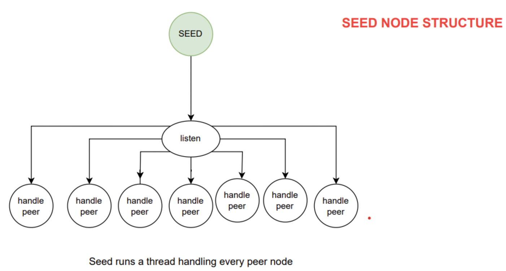
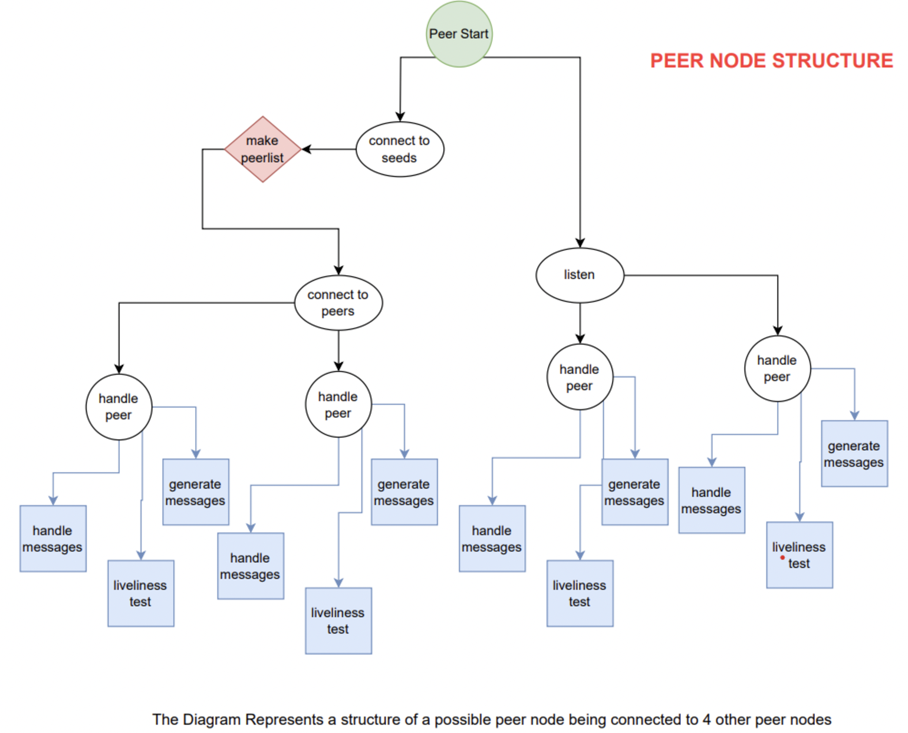

# Peer-to-Peer Network

This project is a simple implementation of a peer-to-peer network with a seed node. The seed node maintains a list of active peers and provides this list to any peer that requests it. The peers can then communicate directly with each other.

## Files

- **peer.py**: This file contains the `Peer` class, responsible for handling peer nodes in the network. It includes methods for connecting to seed nodes, handling peer connections, sending and receiving messages, and performing liveness tests.
- **seed.py**: This file contains the `Seed` class, responsible for managing the seed node. It maintains a list of active peers, listens for incoming peer connections, and shares peer information.
- **seedGen.py**: This file is used to start multiple seed nodes automatically from ports starting at 6000. It asks for the number of seed nodes to spawn and clears the `config.txt` and `outputfile.log` files before execution.
- **config.txt**: This file contains the IP addresses and ports of the seed nodes in the network.
- **outputfile.log**: This file is used for logging events and debugging.

## Features

- **Seed Node Management**: The seed node maintains an active peer list and provides it to requesting peers.
- **Peer Node Communication**: Peers can retrieve a list of active peers from the seed node and establish direct connections.
- **Liveness Test**: Peers periodically send liveness requests to check if other nodes are still active.
- **Message Handling**: Peers can send, receive, and forward messages in the network.
- **Automatic Seed Node Spawning**: The `seedGen.py` script can start multiple seed nodes automatically.
- **Padding and Message Hashing**: Messages include padding and hashing techniques for integrity.

## How to Run

There are two methods to run the code:

### Method 1 (RECOMMENDED - Using `seedGen.py`)

1. Run the `seedGen.py` file to start multiple seed nodes. It will prompt for the number of seeds to spawn and start them from ports starting at 6000.
   ```bash
   python seedGen.py
   ```
2. Run the peer.py file every time you want to start a peer node. It will prompt for the port number to connect to.
   ```bash
   python peer.py
    ```
### Method 2 (Manual Execution)

1.Run the seed node manually by executing seed.py.
   ```bash
     python seed.py
   ```
  Ensure that you clear outputfile.log and config.txt before starting the first seed node.
  
2. Run a peer node manually by executing peer.py.
   ```bash
   python peer.py
     ```
Both methods allow for running on any IP and machine, as the seed and peer classes are not hardcoded to localhost.

# Structure

The structure in terms of thread/code is as follows:

> **NOTE:** If these images are not visible, please check the extras folder in the repository.

### Structure of the Seed Node


### Structure of the Peer Node



## Code Explanation

### `seed.py`
The `Seed` class is responsible for managing the seed node and providing peer lists.

#### Key Methods:
- `__init__(self, port=12345, ip='localhost')`  
  Initializes the seed node and binds it to a given IP and port.
- `config_entry(self)`  
  Ensures the seed node is listed in `config.txt`.
- `listen(self)`  
  Listens for incoming peer connections and starts new threads to handle them.
- `handle_peer(self, peer, addr)`  
  Manages peer communication, storing active peers and providing peer lists.


### `peer.py`
The `Peer` class manages peer-to-peer communication. Upon startup, it creates two key threads:

#### **1. Listening Thread**
- Listens for incoming peer connections.
- Starts a new thread to handle each connected peer.

#### **2. Seed Connection Thread**
- Connects to available seed nodes and retrieves the peer list.
- Performs a union operation to merge multiple peer lists.
- Calls `connect_to_peers()` to establish direct peer-to-peer connections.

#### **connect_to_peers Function**
- Randomly selects up to 4 peers from the available list.
- Ensures a peer does not connect to itself.
- Establishes socket connections and starts a `handle_peer` thread for each peer.

#### **handle_peer Function**
Spawns three threads for each connected peer:

1. **Message Handling Thread**
   - Processes incoming messages.
   - Forwards gossip messages to other peers.
   - Responds to liveness requests.

2. **Liveness Test Thread**
   - Periodically sends a liveness request.
   - If no response is received, marks the peer as inactive.

3. **Gossip Thread**
   - Periodically generates and sends gossip messages.


### `seedGen.py`
The `seedGen.py` script automates seed node creation.

- Prompts for the number of seed nodes to spawn.
- Clears `config.txt` and `outputfile.log` before execution.
- Assigns unique ports starting at 6000.
- Launches seed nodes in separate threads.


## Summary
This project provides a **basic yet functional peer-to-peer network** implementation with:

- Seed nodes that track active peers.
- Peer nodes that self-organize using a seed list.
- Periodic liveness tests and message propagation.
- An option to start multiple seed nodes automatically.

> Note: This is a simple implementation and does not include advanced features such as encryption, NAT traversal, or DHT routing.
